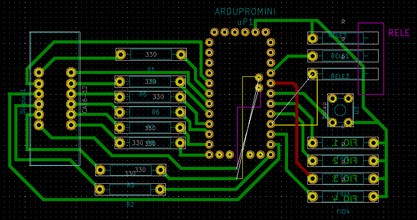
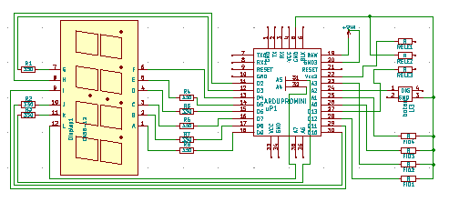
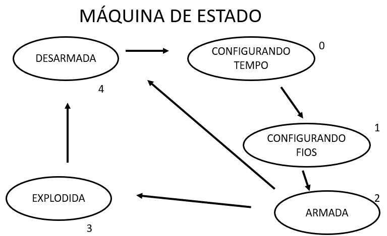
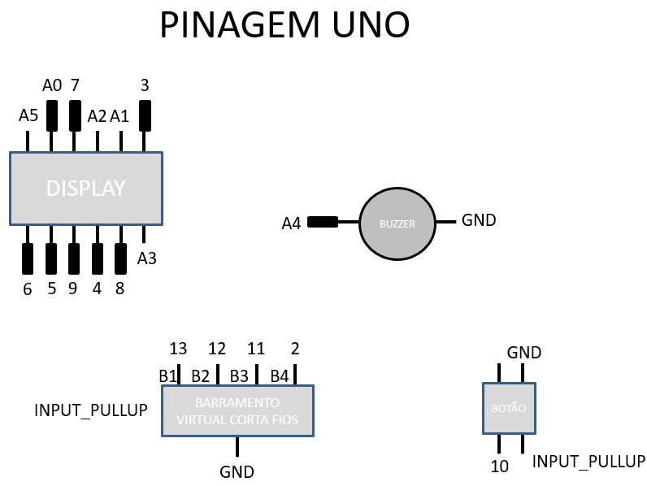
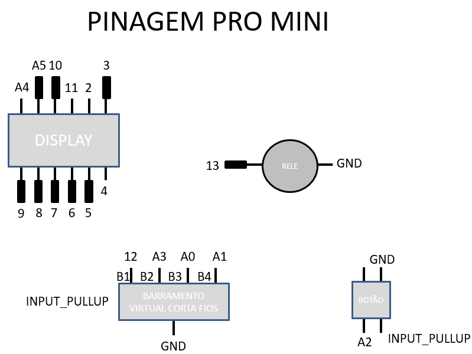
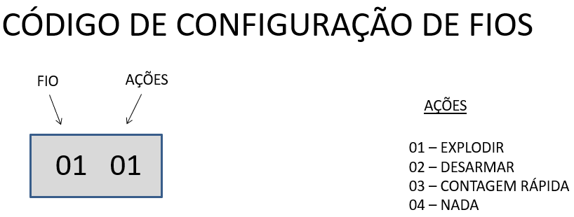

# airsoft-bomb

Thanks for your visit in this repo.

This project was created around 2015, but it didn't have github, and I always distributed it via emails to anyone who wanted it.

It was my first Arduino project to learn.

You can find the video of the prototype at this link. [https://www.youtube.com/watch?v=a9E19bzbtY0](https://www.youtube.com/watch?v=a9E19bzbtY0)

This prototype was developed on Arduino Uno, nevertheless it was also implemented on Arduino Pro Mini.

[Bomba.ino](Bomba.ino) is the Arduino code file. You need the lib **sevseg.h** for interaction with the Display. Because the project is old, I didn't save the lib, probably it is available on the internet.

### Kicad

The schematics in [Kicad](https://www.kicad.org) are available in the kicad-schema directory, with the .mod components. I don't remember how to reassemble it, but they are there.

### More
There are more documentations when I started the project that are below, to help reassemble the project. They can be found in the file [Esquema.pptx](docs/Esquema.pptx)

